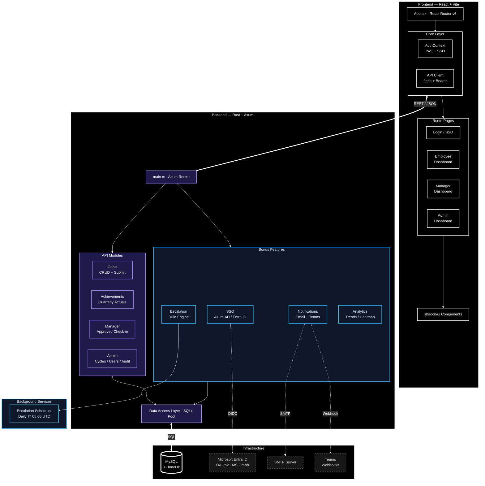

# AtomQuest — Goal Setting & Tracking Portal

**AtomQuest** is a full-stack web application that enables organisations to manage employee goal setting, quarterly achievement tracking, and manager check-ins. Built with a Rust backend and a React frontend, it supports role-based workflows for Employees, Managers, and Admins.

### Tech Stack

| Layer | Technology |
|---|---|
| Frontend | React 18, TypeScript, Vite, shadcn/ui, Tailwind CSS, TanStack Query |
| Backend | Rust 2024, Axum 0.7, SQLx 0.7, Tokio |
| Database | MySQL 8 |
| Auth | JWT (jsonwebtoken) + bcrypt, Azure AD / Entra ID SSO |
| Notifications | SMTP email (lettre), Microsoft Teams Adaptive Cards |
| Scheduling | tokio-cron-scheduler (escalation background jobs) |
| Reports | Excel export via rust_xlsxwriter, CSV |

---

## Architecture



---

## Project Structure

```
atom_quest/
├── backend/                  # Rust + Axum API server
│   ├── src/
│   │   ├── api/              # Route handlers
│   │   │   ├── auth.rs       # JWT login, forgot/reset password
│   │   │   ├── sso.rs        # Azure AD / Entra ID SSO
│   │   │   ├── goals.rs      # Goal sheet CRUD, submission
│   │   │   ├── achievements.rs # Quarterly actual logging
│   │   │   ├── manager.rs    # Approve/return, check-ins, shared goals
│   │   │   ├── admin.rs      # Cycle/department/user management
│   │   │   ├── reports.rs    # Achievement & completion reports (JSON + Excel)
│   │   │   ├── analytics.rs  # QoQ trends, heatmap, distribution, manager effectiveness
│   │   │   ├── notifications_api.rs # Notification preferences
│   │   │   ├── escalation_api.rs    # Escalation rules CRUD + log
│   │   │   └── middleware.rs # JWT auth middleware + role guards
│   │   ├── db/               # Data access layer (SQLx)
│   │   │   ├── models/       # Structs: User, Goal, Achievement, etc.
│   │   │   ├── users.rs
│   │   │   ├── goals.rs
│   │   │   ├── achievements.rs
│   │   │   ├── cycles.rs
│   │   │   └── audit.rs
│   │   ├── utils/            # Helpers (hashing, email, notifications)
│   │   ├── escalation.rs     # Escalation rule engine + scheduler
│   │   └── main.rs           # Entry point, router, migrations
│   ├── migrations/           # SQL schema files
│   └── Cargo.toml
│
├── frontend/                 # React + Vite SPA
│   ├── src/
│   │   ├── pages/            # Route-level pages
│   │   ├── components/       # Reusable UI (shadcn/ui-based)
│   │   ├── contexts/         # AuthContext, ThemeProvider
│   │   ├── lib/              # API client, types, utils
│   │   └── App.tsx           # Router + providers
│   └── package.json
│
└── README.md
```

---

## Feature Map

### Must-Have (Phase 1–2)

| Feature | Status |
|---|---|
| Employee goal sheet creation & submission | Done |
| Select Thrust Area, set targets/weightage | Done |
| Validation: total weightage = 100%, min 10% per goal, max 8 goals | Done |
| Manager approval workflow (approve/return/edit) | Done |
| Goal locking on approval | Done |
| Shared goals (push departmental KPIs to multiple employees) | Done |
| Quarterly achievement logging with UoM-based scoring | Done |
| Status per goal: Not Started / On Track / Completed | Done |
| Manager check-in comments per quarter | Done |
| Achievement report (JSON + Excel export) | Done |
| Completion dashboard by department | Done |
| Audit trail for post-lock changes | Done |

### User Roles

| Role | Capabilities |
|---|---|
| Employee | Create/edit goals (draft only), log achievements, view locked sheets |
| Manager (L1) | Team dashboard, approve/return sheets, edit goals inline, add check-in comments |
| Admin | Manage cycles, departments, thrust areas, users; unlock sheets; view audit log |

### Bonus Features

| Feature | Description |
|---|---|
| Azure AD / Entra ID SSO | OAuth2 sign-in, group-based role mapping, org hierarchy sync via MS Graph |
| Email & Teams Notifications | Submission, approval, return, and check-in reminders via SMTP + Adaptive Cards |
| Escalation Module | Rule-based; triggers on overdue submissions, pending approvals, missing check-ins; 3-stage chain |
| Analytics | QoQ trends, org-wide progress heatmap, goal distribution by Thrust Area/UoM, manager effectiveness |

---

## Quick Start

### Prerequisites

- Rust (stable 2024 edition)
- Node.js 18+ / Bun
- MySQL 8

### 1. Backend

```bash
cd backend
cp .env.example .env    # configure DATABASE_URL, JWT_SECRET, SMTP, Azure vars
cargo run
```

On first start, migrations run automatically and demo data is seeded.

### 2. Frontend

```bash
cd frontend
cp .env.example .env    # set VITE_API_URL
npm install && npm run dev
```

### 3. Demo Users

All share password: **`password123`**

| Role | Email |
|---|---|
| Admin | `admin@demo.com` |
| Manager | `manager@demo.com` |
| Employee | `employee@demo.com` |
